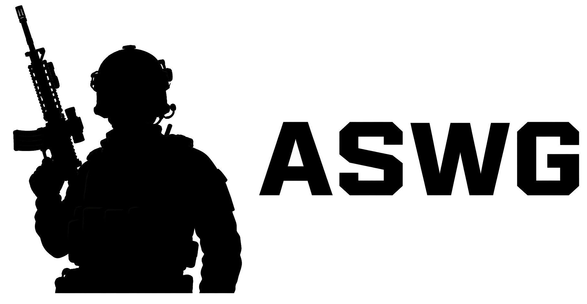
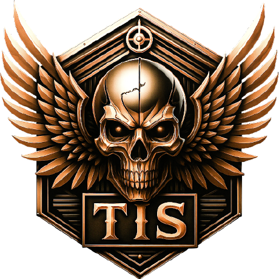

  <picture>
    <source media="(prefers-color-scheme: dark)" srcset="readme_data/aswg_logo_light.png">
    <source media="(prefers-color-scheme: light)" srcset="readme_data/aswg_logo_dark.png">
    
  </picture>

  <h1 style="font-size: 2rem; font-weight: bold">ASWG - Arma Server Web Gui</h1>

  
  
  

## General

ASWG is a user-friendly management GUI for Arma 3 server.

It is a web application that was built with a goal to provide an easy way to manage Arma server located on Linux
systems (however it supports Windows as well!).

You can easily start/stop your server, view server console, change server configuration `server.cfg`, install missions
and manage mods. Also, it allows you to automatically download and install workshop mods via SteamCMD.

Check the feature list below to get to know more.

**If you find any issues while using **ASWG** or you want to share your thoughts on what could be added, post them
at [Github](https://github.com/Aquerr/arma-server-web-gui/issues)** or let me know
through my [Discord Server](https://discord.gg/Zg3rWta).

**If you enjoy using ASWG, give this repo a star!**

## Features

* Fast setup
* Windows support
* Linux support (currently tested on Ubuntu)
* [Docker support](https://hub.docker.com/r/aquerr/arma-server-web-gui)
* Server Console + Player list
* Edit server configuration (server.cfg and basic.cfg)
* Difficulty management
* Mods management
* Missions management
* Load exported mod presets from Arma 3 Launcher
* Workshop and mods installation via SteamCMD (see installation instructions below)
* Multi-user support

### Screenshots

# Setup

ASWG can be installed directly on a system or via Docker.

## Manual Setup

- Install Java Runtime Environment (JRE) 25
- [Install Arma Server in desired directory](https://community.bistudio.com/wiki/Arma_3:_Dedicated_Server)
    - Can be skipped as ASWG can install the server files for you during first server launch
      using [SteamCMD](#SteamCMD).
- Get the ASWG JAR file (using one of below options):
    - [Download ASWG from Github Packages](https://github.com/Aquerr/ARMA-Server-Web-Gui/packages/2322633). The only
      file you will need to download is: `arma-server-web-gui-<version>.jar` (should end with `.jar`).
    - or [build ASWG yourself](#Building).
- Put `ASWG.jar` file in desired folder where you want your ASWG to be running.
- Run `ASWG.jar` by executing `java -jar aswg.jar` in the console.
    - To change `ASWG` port, for example to `8444`. Run it with `java -Dserver.port=8444 -jar aswg.jar`
- ASWG configuration file will be created after the first run. Edit it to set the ASWG username and password. Restart
  ASWG after making changes.
- When running on **Linux**, it is recommended to run ASWG as a **separate user**. Also, remember to `chown` all
  generated files if needed.
- Open `http://localhost:8085` to enter ASWG.
- Extra: If you would like to update your game or download Steam workshop mods, configure SteamCMD properties either
  through settings page or ASWG config file.

### SteamCMD

ASWG has a support for SteamCMD that can be used to install/update Arma 3 game server and download mods from the Steam
workshop.

If you are using 2FA on Steam then you will need to disable it as ASWG does not work well with Steam 2FA.
Because of that, it is advised to use a separate Steam account just for your Arma 3 server.

**For how to install SteamCMD installation check the official**
[SteamCMD wiki](https://developer.valvesoftware.com/wiki/SteamCMD).

**NOTE: When using ASWG docker image, SteamCMD is already installed inside it so the only thing you need to do is to
configure it.**

## Docker setup

Docker image for ASWG can be found [here](https://hub.docker.com/r/aquerr/arma-server-web-gui)

A sample Docker Compose file can be
found [here](https://github.com/Aquerr/ARMA-Server-Web-Gui/blob/main/docker-compose.yml)

Note: ASWG Docker image already contains SteamCMD so you don't need to install it by yourself.
You still need to configure it through ASWG interface if you want to use it.

# Building

- Install JDK 25
- Clone repo
- Go to project directory
- Run `./mvnw.cmd clean package`
- The `ASWG.jar` artifact will be located inside `target` directory.

## Credits / Thanks

Many thanks to:

- **[mateo9x](https://github.com/mateo9x)** (for help with dark theme and some front-end things)

## Used By

Communities using ASWG:

  
  

If you want to add your unit/group here, you are more than welcome to do it through
a [PR](https://github.com/Aquerr/ARMA-Server-Web-Gui/pulls) or let me know via [Discord](https://discord.gg/Zg3rWta).

## License

[Apache License 2.0](https://github.com/Aquerr/ARMA-Server-Web-Gui/blob/main/LICENSE)

## Donation

Creation of this project is really a time-consuming task. If you would like to support me then you can star this repo or
send me some cookies through [PayPal](https://paypal.me/aquerrnerdi).
